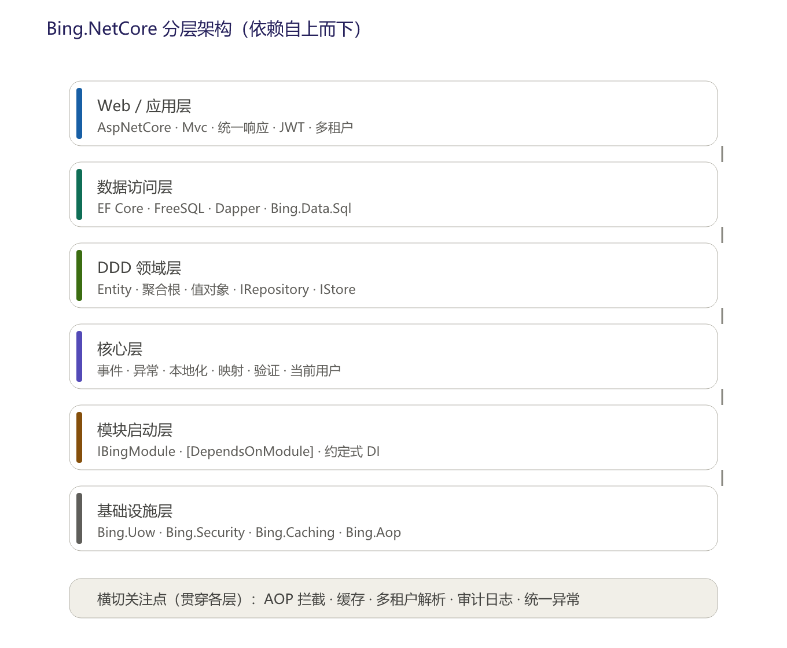
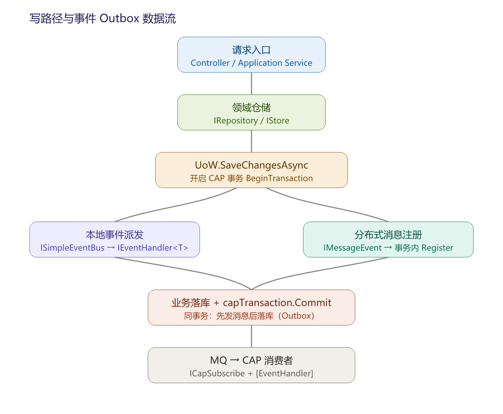
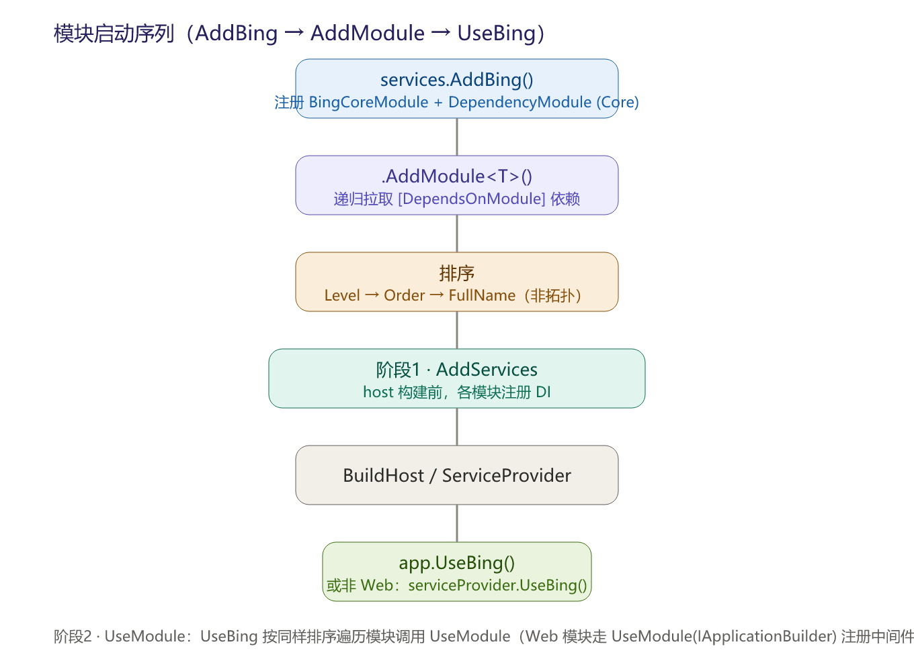
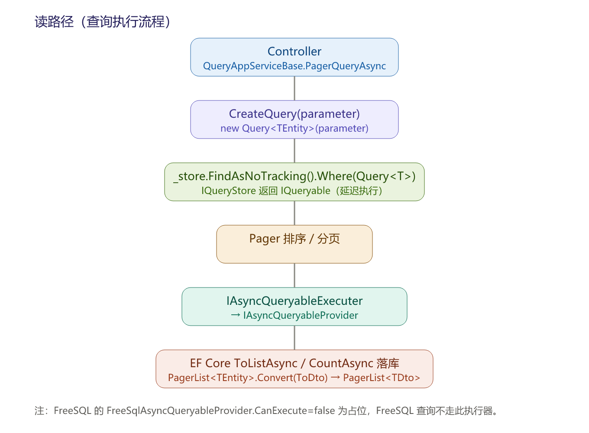
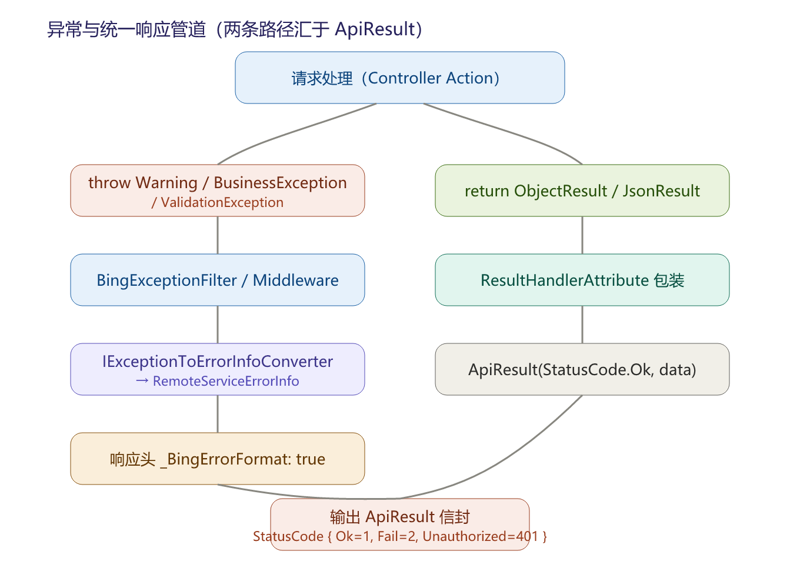
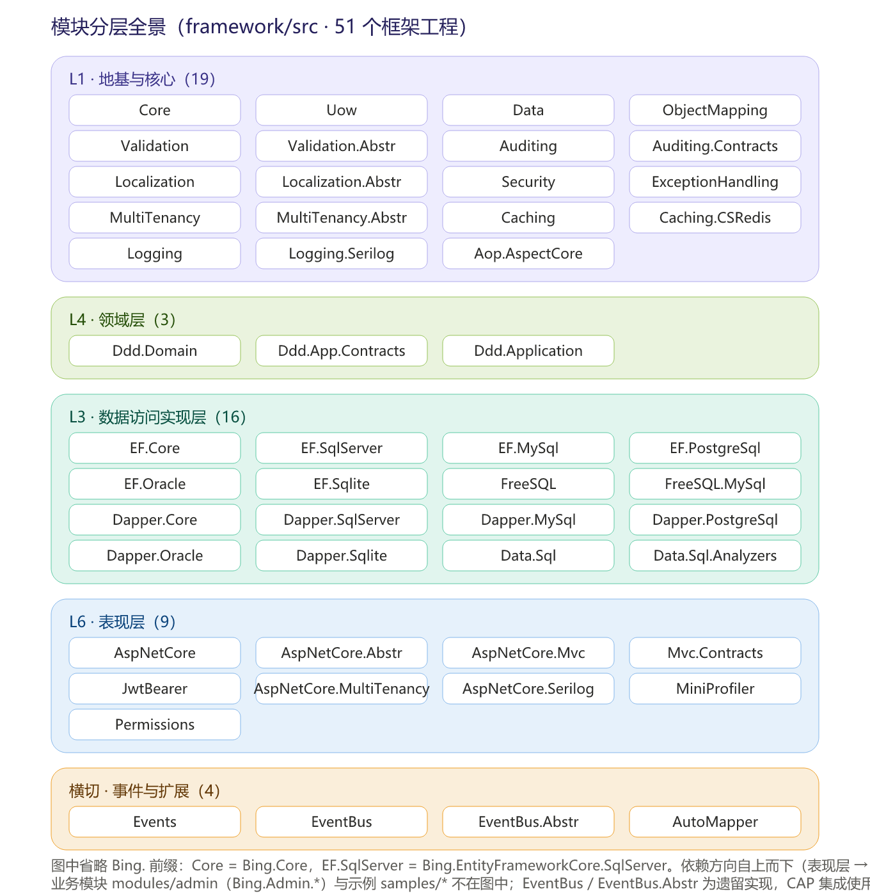

# Bing.NetCore 架构文档

> **适用版本**：框架 `7.0.0`（`version.props`）｜ 目标框架：类库 `netstandard2.0`、Web / 应用 `net6.0`｜ 内容核对：2026-09-18｜ 版本历史见 [发行说明](../ReleaseNotes.md)

> 本文是**纯架构结构**视角：描述系统的分层、模块、组件职责、接口边界与部署形态，帮助读者快速建立“代码长什么样、谁依赖谁”的全局认知。设计动机与权衡请见《设计思路文档》；安装配置与使用示例请见《使用文档》；未列入本文 §11/§12 的边缘包见《[组件库文档](../guides/组件库文档.md)》；跨版本升级见《[迁移指南](../migrations/README.md)》；数据访问能力边界见《[能力矩阵](../getting-started/能力矩阵.md)》；术语辨析见《[术语表](../getting-started/术语表.md)》。全部插图（PNG 及 SVG 源文件）位于 `docs/images/`，本文离线可读。

---

## 1. 架构总览

Bing.NetCore 是一个基于 .NET 平台的**分层应用框架**，采用“模块化启动”范式。代码按能力拆分为数十个细粒度工程，按职责归为六层（自底向上）：

```
┌──────────────────────────────────────────────────────────────────┐
│ L6  表现 / 接口层                                                    │
│   Bing.AspNetCore.Mvc（控制器基类 / 统一响应 / CRUD 基类）           │
│   Bing.AspNetCore.Authentication.JwtBearer / MultiTenancy / Serilog│
├──────────────────────────────────────────────────────────────────┤
│ L5  应用层（Application）                                           │
│   Bing.Ddd.Application · Bing.Ddd.Application.Contracts             │
├──────────────────────────────────────────────────────────────────┤
│ L4  领域层（Domain）                                                │
│   Bing.Ddd.Domain（实体/聚合根/仓储接口/领域事件/变更跟踪）          │
│   Bing.Data（查询对象/分页/条件）· Bing.Uow（工作单元）              │
│   Bing.ObjectMapping · Bing.Validation · Bing.Auditing             │
├──────────────────────────────────────────────────────────────────┤
│ L3  数据访问实现层                                                  │
│   Bing.EntityFrameworkCore* · Bing.FreeSQL* · Bing.Dapper.*        │
│   Bing.Data.Sql（通用流利 SQL 引擎 + 方言 + 提供程序）              │
├──────────────────────────────────────────────────────────────────┤
│ L2  横切基础层                                                      │
│   Bing.Uow · Bing.Security · Bing.Permissions · Bing.Localization  │
│   Bing.ExceptionHandling · Bing.MultiTenancy · Bing.Aop.AspectCore  │
├──────────────────────────────────────────────────────────────────┤
│ L1  核心地基层                                                      │
│   Bing.Core（模块系统 / 约定式 DI / 反射查找 / 异常 / 选项）         │
└──────────────────────────────────────────────────────────────────┘

横切（任意层可用）：Bing.Caching* · Bing.Logging* · Bing.EventBus* ·
Bing.Events · Bing.Emailing · Bing.MailKit · Bing.TextTemplating* ·
Bing.Locks.CSRedis
```

**依赖方向**：上层依赖下层，下层不感知上层。领域层（L4）只定义接口（如 `IRepository`、`IUnitOfWork`），具体实现落在数据访问层（L3）；Web 层（L6）依赖应用层（L5），应用层依赖领域层（L4）。



---

## 2. 模块依赖图（基于真实工程引用）

> 真实工程引用集中在各工程的 `references.props` / `dependency.props`（不在 `.csproj` 内联），下表为实际 `<ProjectReference>` 边。注意：并非所有模块都有 `*Abstractions` 工程——实际存在的抽象工程只有 `Bing.Validation.Abstractions`、`Bing.Localization.Abstractions`、`Bing.Auditing.Contracts`、`Bing.MultiTenancy.Abstractions`、`Bing.AspNetCore.Abstractions`；Security / Permissions / ExceptionHandling / Caching 的抽象直接并入主工程，无独立 `*Abstractions` 包。

| 模块 | 直接依赖（Bing.* 工程） |
| --- | --- |
| Bing.Core | —（地基） |
| Bing.Uow · Bing.Data · Bing.ObjectMapping · Bing.Security · Bing.ExceptionHandling · Bing.Caching · Bing.Logging | Bing.Core |
| Bing.Localization | Bing.Localization.Abstractions |
| Bing.Validation | Bing.Core · Bing.Validation.Abstractions |
| Bing.Auditing | Bing.Data · Bing.Auditing.Contracts · Bing.Security |
| Bing.MultiTenancy | Bing.Security · Bing.MultiTenancy.Abstractions |
| Bing.Aop.AspectCore | Bing.Core · Bing.Validation |
| Bing.Ddd.Domain | Bing.Aop.AspectCore · Bing.Auditing.Contracts · Bing.Data · Bing.Logging · Bing.Uow · Bing.Validation |
| Bing.Ddd.Application.Contracts | Bing.Aop.AspectCore · Bing.Uow · Bing.Validation · Bing.Auditing |
| Bing.Ddd.Application | Bing.ObjectMapping · Bing.Ddd.Application.Contracts · Bing.Ddd.Domain |
| Bing.EntityFrameworkCore | Bing.Data.Sql · Bing.Ddd.Domain · Bing.Auditing |
| Bing.EntityFrameworkCore.{SqlServer,MySql,PostgreSql,Oracle,Sqlite} | Bing.EntityFrameworkCore |
| Bing.FreeSQL | Bing.Data.Sql · Bing.Ddd.Domain · Bing.Security |
| Bing.FreeSQL.MySql | Bing.FreeSQL · Bing.Auditing |
| Bing.Dapper.Core | Bing.Data.Sql |
| Bing.Dapper.{SqlServer,MySql,PostgreSql,Oracle,Sqlite} | Bing.Dapper.Core |
| Bing.Data.Sql | Bing.Data · Bing.Data.Sql.Analyzers |
| Bing.Events | Bing.Aop.AspectCore · Bing.Data |
| Bing.EventBus | Bing.Data |
| Bing.AspNetCore | Bing.AspNetCore.Abstractions · Bing.Logging · Bing.ExceptionHandling · Bing.Security · Bing.Aop.AspectCore |
| Bing.AspNetCore.Mvc | Bing.AspNetCore.Mvc.Contracts · Bing.AspNetCore |
| Bing.AspNetCore.Mvc.Contracts | Bing.Ddd.Application |
| Bing.AspNetCore.Authentication.JwtBearer | Bing.AspNetCore.Abstractions · Bing.Caching · Bing.Security |
| Bing.AspNetCore.MultiTenancy | Bing.AspNetCore · Bing.MultiTenancy |
| Bing.AspNetCore.Serilog · Bing.MiniProfiler | Bing.AspNetCore |
| Bing.AutoMapper | Bing.ObjectMapping |
| Bing.Permissions | Bing.AspNetCore · Bing.Ddd.Domain |

要点：
- `Bing.AspNetCore.Mvc.Contracts` 是**打包壳工程**（无 `.cs` 源文件），仅转发引用 `Bing.Ddd.Application`，把 DTO / 应用契约并入 Mvc.Contracts 包。真实契约在 `Bing.Ddd.Application.Contracts`。
- `Bing.AspNetCore` 与 `Bing.AspNetCore.Mvc` 共享 `Bing.AspNetCore.Mvc` 命名空间（`ApiResult`/`BingControllerBase` 物理位于 `Bing.AspNetCore` 工程，控制器 CRUD 基类位于 `Bing.AspNetCore.Mvc` 工程）。
- 依赖边只决定“哪些模块被纳入”，模块**启用顺序**由 `ModuleLevel → Order → FullName` 决定（见 §8），不做基于 `[DependsOnModule]` 的拓扑排序。
- 一处值得注意的耦合：`Bing.Permissions` 直接引用 `Bing.AspNetCore`（为集成 HTTP/授权），属表现层向下的反向依赖，使用权限模块时需注意宿主必须含 ASP.NET Core。

---

## 3. 核心组件与职责边界

### 3.1 启动与装配（L1）
- **模块系统**（`Bing.Core.Modularity`）：`IBingModule` / `BingModule` 定义两阶段生命周期 `AddServices` + `UseModule`；`[DependsOnModule]` 声明依赖；`ModuleLevel` 控制启动顺序（Core < Framework < Application < Business）。
- **入口**：`services.AddBing().AddModule<T>()` → `app.UseBing()`（Web）；非 Web 用 `serviceProvider.UseBing()`。
- **约定式 DI**（`Bing.Core.DependencyInjection`）：实现 `ISingletonDependency` / `IScopedDependency` / `ITransientDependency` 的类型由 `DependencyModule` 自动扫描注册；`[Dependency(...)]` 控制生命周期与替换。

### 3.2 领域层（L4）
| 组件 | 职责边界 |
| --- | --- |
| `Bing.Ddd.Domain` | 实体 / 聚合根 / 值对象；仓储接口 `IRepository`/`IQueryRepository`/`ICompactRepository`；存储接口 `IStore`/`IQueryStore`（注意定义在 `Bing.Ddd.Domain`，非 `Bing.Data`）；领域事件、变更跟踪 |
| `Bing.Data` | 查询对象 `Query`/`IQuery`、查询参数 `QueryParameter`、分页 `Pager`/`PagerList`、条件 `ICondition`/`*Condition` |
| `Bing.Uow` | `IUnitOfWork` / `IUnitOfWorkManager`（提交边界） |
| `Bing.ObjectMapping` | `IObjectMapper` 抽象（由 AutoMapper 实现） |
| `Bing.Validation` | 基于 DataAnnotations 的校验框架、中文业务特性 |
| `Bing.Auditing` | 审计实体接口（`ICreationAuditedObject` 等）、`IAuditingManager`/`IAuditingStore` 契约 |

### 3.3 数据访问实现层（L3）
- **EF Core**（`Bing.EntityFrameworkCore*`）：运行时命名空间 `Bing.Datas.EntityFramework.Core`；`UnitOfWorkBase : DbContext` 实现 `IUnitOfWork`；`RepositoryBase`/`StoreBase`/`CompactRepositoryBase` 实现领域仓储接口；支持 5 个 Provider（SqlServer/MySql/PostgreSql/Oracle/Sqlite）。
- **FreeSQL**（`Bing.FreeSQL*`）：结构与 EF 对称；`Bing.Uow.UnitOfWorkBase : FreeSql DbContext`；当前仅 MySql Provider。
- **Dapper**（`Bing.Dapper.*`）：把 `Bing.Data.Sql` 的流利 SQL 引擎落地为可执行 `ISqlQuery`/`ISqlExecutor`；**不提供**领域层仓储/工作单元。
- **Bing.Data.Sql**：与 ORM 无关的通用流利 SQL 引擎（`ISqlQuery`/`ISqlBuilder`/`IDialect`/`ISqlProvider`），被上述三者复用，是跨库 SQL 能力的基石。

### 3.4 应用层（L5）
- `Bing.Ddd.Application`：`AppServiceBase` / `QueryAppServiceBase` / `DeleteAppServiceBase` / `CrudAppServiceBase` 应用服务基类。
- `Bing.Ddd.Application.Contracts`：`IAppService`/`ICrudAppService`/`IQueryAppService`、DTO 基类 `DtoBase`/`RequestBase`、`[UnitOfWork]` 拦截特性。

### 3.5 表现层（L6）
| 组件 | 职责边界 |
| --- | --- |
| `Bing.AspNetCore` | 模块化管道、中间件栈（`BingExceptionHandlingMiddleware` 等）、`ApiResult`、控制器基类 `BingControllerBase`/`ApiControllerBase` |
| `Bing.AspNetCore.Mvc` | `QueryControllerBase`/`CrudControllerBase`、全局结果过滤 `ResultHandlerAttribute`、MVC 选项扩展 |
| `Bing.AspNetCore.Authentication.JwtBearer` | `AddJwt`（配置节 `JwtOptions`，策略名 `"jwt"`） |
| `Bing.AspNetCore.MultiTenancy` | `MultiTenancyMiddleware` + 租户解析贡献者链 |
| `Bing.AspNetCore.Serilog` / `MiniProfiler` | 日志增强 / 性能监控（均以 Module 形式注册） |

### 3.6 横切能力（任意层）
缓存（`Bing.Caching*`）、日志（`Bing.Logging*`）、事件总线（`Bing.EventBus*`/`Bing.Events`）、邮件（`Bing.Emailing`/`Bing.MailKit`）、文本模板（`Bing.TextTemplating*`）、分布式锁（`Bing.Locks.CSRedis`）。多数靠约定式 DI 自动注册 + `Options` 配置启用。

---

## 4. 关键接口边界（契约 ↔ 实现）

| 契约（领域层定义） | 实现（数据访问层） |
| --- | --- |
| `Bing.Uow.IUnitOfWork` | `Bing.Datas.EntityFramework.Core.UnitOfWorkBase`（EF）/ `Bing.Uow.UnitOfWorkBase`（FreeSQL） |
| `Bing.Domain.Repositories.IRepository<TEntity,TKey>` | `RepositoryBase`（EF / FreeSQL） |
| `Bing.Data.IStore<TEntity,TKey>` | `StoreBase`（EF / FreeSQL） |
| `Bing.ObjectMapping.IObjectMapper` | `Bing.AutoMapper.AutoMapperObjectMapper` |
| `Bing.Caching.ICache` | `CSRedisCacheManager` / `FreeRedisCacheManager` / `CacheManager`（EasyCaching） |
| `Bing.Security.Users.ICurrentUser` | `CurrentUser` |
| `Bing.MultiTenancy.ICurrentTenant` | `CurrentTenant` |

这条“契约在领域、实现在基础设施”的边界是整个框架解耦多 ORM 的核心。

---

## 5. 部署与运行形态

- **类库**：默认 `netstandard2.0`（最大化可复用性），可被 net framework / net core 引用。
- **Web / 应用工程**：`net6.0`（依赖 ASP.NET Core / EF Core 6 / CAP 8 的工程覆盖目标框架）。
- **构建 SDK**：`global.json` 固定为 .NET SDK 8.0.424（编译用）。
- **宿主形态**：ASP.NET Core Web API（主流，admin 模块即此形态）、控制台 / WinForm（用 `serviceProvider.UseBing()` 启动模块）、后台任务（Hangfire，见 `samples/Bing.Samples.Hangfire`）。
- **数据库**：SqlServer / MySql / PostgreSQL / Oracle / Sqlite，由对应 Provider 工程与 `DatabaseType` 枚举驱动。
- **进程内设施**：缓存（Redis/内存）、日志（Serilog/Exceptionless）、事件（本地内存 + CAP→RabbitMQ 等消息队列）。

---

## 6. 参考实现与示例

- `modules/admin`：后台管理系统完整参考实现（领域 → 仓储 → 应用服务 → Web API），演示各层真实组织方式。
- `samples/Bing.Samples.WebApi`：最小 Web API（模块引导 + 控制器）。
- `samples/Bing.Samples.Hangfire`：控制台 + Hangfire 后台任务集成示例。

---

## 7. 一图速览（分层 + 数据流）

下文的“数据流”以文字描述四条链路（写 / 读 / 事件 / 异常）；配套的**写路径与事件 Outbox 数据流图**如下。



- **写请求**：HTTP → 多租户中间件 → JWT 认证 → Controller → ApplicationService → `MapTo<Entity>` → Repository/Store.Add → `[UnitOfWork]`/显式 `CommitAsync` → `UnitOfWorkBase.SaveChangesAsync`（EF/FreeSQL）→ 派发领域事件；事件经两层总线（本地 `ISimpleEventBus` + 分布式 `IMessageEventBus`/CAP，Outbox 事务）。
- **读请求**：Controller → `QueryAppServiceBase.PagerQueryAsync` → `IQueryStore.FindAsNoTracking().Where(Query<T>)`（`IQueryable` 延迟）→ `IAsyncQueryableExecuter` → `IAsyncQueryableProvider`（EF Core 真正落库；FreeSQL 的 Provider 为占位 `CanExecute=false`）→ `PagerList<TDto>` → `ApiResult.Success(result)`。
- **事件流**：聚合根 `AddDomainEvent` → 提交时经 `IEventBus` 两层发布 → 本地 `ISimpleEventBus`（进程内 `IEventHandler<T>`）+ 分布式 `IMessageEventBus`（CAP，Outbox 同事务）。详见《子系统深挖文档》。
- **异常流**：`throw Warning/BusinessException/ValidationException` → `BingExceptionHandlingMiddleware`/`BingExceptionFilter` → `IExceptionToErrorInfoConverter` → `RemoteServiceErrorInfo{Code,Message}` + 响应头 `_BingErrorFormat: true` → 输出 `ApiResult`。

---

## 8. 模块系统与启动序列

### 8.1 生命周期两阶段
`IBingModule`（`Bing.Core.Modularity`）定义两阶段：
- `IServiceCollection AddServices(IServiceCollection services)`：host 构建前注册 DI（阶段1）。
- `void UseModule(IServiceProvider provider)`：provider 构建后初始化（阶段2）；Web 模块还有 `AspNetCoreBingModule.UseModule(IApplicationBuilder app)` 重载，用于注册中间件。

抽象基类 `BingModule` 默认 `Level => ModuleLevel.Business`、`Order => 0`。

### 8.2 模块级别 ModuleLevel
`enum ModuleLevel { Core = 1, Framework = 10, Application = 20, Business = 30 }`。

### 8.3 依赖声明 `[DependsOnModule]`
`[DependsOnModule(typeof(XxxModule), ...)]`（`AllowMultiple=true`）声明本模块需先行加载的模块；`AddModule<T>()` 会**递归**拉取全部直接+间接依赖并去重（仅决定“包含哪些模块”，不改变顺序）。

### 8.4 启动时序（关键）
入口：`services.AddBing(setupAction).AddModule<T>()` → `app.UseBing()`（Web）/ `serviceProvider.UseBing()`（非 Web）。

排序规则（实际源码）：**只按 `Level` 升序 → `Order` 升序 → `FullName` 升序**，**不做基于依赖边的拓扑排序**。
```csharp
_modules = _modules.OrderBy(m => m.Level).ThenBy(m => m.Order).ThenBy(m => m.GetType().FullName).ToList();
```
因此：
- 阶段1（`AddServices`）：`AddBing` 注册 `BingCoreModule` + `DependencyModule`（Core 级，最先），随后各模块按上述顺序 `services.AddSingleton(typeof(BingModule), module); module.AddServices(services);`——均在 host 构建前完成。
- 阶段2（`UseModule`）：`UseBing()` 取已注册单例模块，按同样顺序遍历调用 `module.UseModule(...)`（Web 版对 `AspNetCoreBingModule` 走 `UseModule(app)`）。

> 设计含义：模块间若有“先初始化 A 再初始化 B”的硬顺序需求，必须用 `Level`/`Order` 表达，而不能只靠 `[DependsOnModule]`（依赖特性仅保证 A 被纳入，不保证 A 先于 B 执行 `UseModule`）。



---

## 9. 约定式 DI 自动注册

`DependencyModule : BingModule`（`Bing.DependencyInjection`，`Level=Core, Order=1`）在 `AddServices` 阶段通过 `DependencyTypeFinder`（基于 `IAllAssemblyFinder` 扫所有程序集）找出待注册类型并自动写入 `IServiceCollection`。

### 9.1 约定标记
- 实现 `ISingletonDependency` / `IScopedDependency` / `ITransientDependency`（均空接口，语义标记）→ 对应 `Singleton`/`Scoped`/`Transient`。
- 或给类加 `[Dependency(ServiceLifetime, TryAdd=, ReplaceExisting=, AddSelf=)]` 显式控制。

### 9.2 扫描与注册
筛选：`class && !abstract && !interface && !HasAttribute<IgnoreDependency> && (实现任一 *Dependency 接口 或 携带 [Dependency])`。
注册：类型实现的**全部接口**（除 `IDisposable` 与带 `[IgnoreDependency]` 者）都会作为服务类型注册；无接口时注册自身（`TryAdd`），`[Dependency(AddSelf=true)]` 时额外注册自身。生命周期映射：`[Dependency]` 优先，否则按标记接口。

### 9.3 优先级与替换
- 特性 > 接口：`ISingletonDependency` + `[Dependency(Lifetime=Scoped)]` 以 **Scoped** 生效。
- 首接口注册策略：`ReplaceExisting=true` → `services.Replace`；`TryAdd=true` → `services.TryAdd`；否则 `services.Add`。
- 同一接口多个实现时，`[MultipleDependency]`（如 `IAsyncQueryableProvider`）用于集合注入。

> 与 ABP 的 `ISingletonDependency` 约定一致，但 Bing 用 `[Dependency]` 的 `ReplaceExisting`/`TryAdd` 显式控制覆盖，避免自动注册被意外替换。

---

## 10. 读路径与异常管道（代码级）

### 10.1 读路径
`QueryAppServiceBase.PagerQueryAsync`：`CreateQuery(parameter)`（`new Query<TEntity>(parameter)`）→ `_store.FindAsNoTracking().Where(query)`（`IQueryStore` 返回 `IQueryable`，延迟执行）→ `Pager` 排序/分页 → `IAsyncQueryableExecuter`（转 `IAsyncQueryableProvider` 真正落库，EF Core 实现委托 `queryable.ToListAsync/CountAsync`；FreeSQL 的 `FreeSqlAsyncQueryableProvider.CanExecute=false` 为占位）→ `PagerList<TEntity>.Convert(ToDto)` → `PagerList<TDto>`。

> 查询对象 `Query<T>` 承载条件/排序/分页；执行被推迟到 `IAsyncQueryableExecuter`，使领域/应用层不依赖具体 ORM。



### 10.2 异常 → 统一响应
- 异常类型：`Warning`（`Bing.Exceptions`，含 `Code`/`HttpStatusCode`）、`ConcurrencyException : Warning`、`BusinessException`（`Bing`，含 `Code`/`Details`/`LogLevel`）、`ValidationException : BingException`（`Bing.Validation`）。
- 捕获：`BingExceptionHandlingMiddleware`（`IMiddleware`）与 `BingExceptionFilter`（`IAsyncExceptionFilter`）捕获异常，写入响应头 `_BingErrorFormat: true`（常量，非 `Bing-Error-Format`），经 `IExceptionToErrorInfoConverter` 生成 `RemoteServiceErrorInfo{Code,Message,Details,ValidationErrors}`。
- 结果包装：`ResultHandlerAttribute`（`ResultFilterAttribute`）把 `ObjectResult`/`JsonResult`/`EmptyResult`/`BadRequestObjectResult` 等包成 `ApiResult(StatusCode, Message, Data)`；业务代码用 `ApiResult.Success(data)` 返回 `StatusCode.Ok=1`。`ApiResult` 属性：`int Code`、`string Message`、`object Data`、`DateTime OperationTime`。`StatusCode { Ok=1, Fail=2, Unauthorized=401 }`。



---

## 11. 模块清单（每个工程一句话职责）

下列为 `framework/src` 下的框架工程（业务模块 `modules/admin`、示例 `samples/*` 不在此列）。按层分组，每个工程配一句话职责；命名空间/依赖边以 §2 为准。

**「模块分层全景」总览图**（51 个工程按层排布：L1 地基与核心 19 / L4 领域层 3 / L3 数据访问实现层 16 / L6 表现层 9 / 横切事件与扩展 4；图中省略 `Bing.` 前缀）：



### 11.1 地基与核心（L1）

| 工程 | 一句话职责 |
| --- | --- |
| Bing.Core | 框架地基：模块系统（`IBingModule`/`ModuleLevel`/`[DependsOnModule]`）、约定式 DI（`DependencyModule`）、程序集/类型查找、异常基类（`Warning`/`BusinessException`）、选项。 |
| Bing.Uow | 工作单元契约 `IUnitOfWork` / `IUnitOfWorkManager` 及抽象基类。 |
| Bing.Data | 查询对象 `Query`/`IQuery`、查询参数、分页 `Pager`/`PagerList`、条件 `ICondition`/`*Condition`。 |
| Bing.ObjectMapping | 对象映射抽象 `IObjectMapper`（具体由 Bing.AutoMapper 实现）。 |
| Bing.Validation | 基于 DataAnnotations 的校验框架与中文业务验证特性。 |
| Bing.Validation.Abstractions | 校验相关抽象接口（被领域/应用层引用）。 |
| Bing.Auditing | 审计实体接口（`ICreationAuditedObject` 等）与 `IAuditingManager`/`IAuditingStore` 契约。 |
| Bing.Auditing.Contracts | 审计契约工程（供领域层引用，不含运行时实现）。 |
| Bing.Localization | 本地化实现。 |
| Bing.Localization.Abstractions | 本地化抽象接口。 |
| Bing.Security | 安全基件：当前用户 `ICurrentUser`、身份/权限基础类型。 |
| Bing.ExceptionHandling | 异常处理：`IExceptionToErrorInfoConverter`、`RemoteServiceErrorInfo` 错误信封。 |
| Bing.MultiTenancy | 多租户：`ICurrentTenant`、租户解析与切换。 |
| Bing.MultiTenancy.Abstractions | 多租户抽象接口。 |
| Bing.Caching | 缓存抽象 `ICache`。 |
| Bing.Caching.CSRedis | 基于 CSRedis / FreeRedis 的 `ICache` 实现。 |
| Bing.Logging | 日志抽象。 |
| Bing.Logging.Serilog | Serilog 日志实现。 |
| Bing.Aop.AspectCore | 基于 AspectCore 的 AOP 拦截基础设施（`[UnitOfWork]`、审计等切面）。 |

### 11.2 领域层（L4）

| 工程 | 一句话职责 |
| --- | --- |
| Bing.Ddd.Domain | DDD 领域层：实体/聚合根/值对象、仓储接口 `IRepository`/`IStore`/`IQueryStore`、领域事件、变更跟踪。 |
| Bing.Ddd.Application.Contracts | 应用契约：`IAppService`/`ICrudAppService`、`DtoBase`/`RequestBase`、`[UnitOfWork]` 拦截特性。 |
| Bing.Ddd.Application | 应用服务基类 `AppServiceBase`/`QueryAppServiceBase`/`CrudAppServiceBase`，接入 `IAsyncQueryableExecuter`。 |

### 11.3 数据访问实现层（L3）

| 工程 | 一句话职责 |
| --- | --- |
| Bing.EntityFrameworkCore | EF Core 数据访问核心：`UnitOfWorkBase:DbContext`、`RepositoryBase`/`StoreBase`（运行时命名空间 `Bing.Datas.EntityFramework.Core`）。 |
| Bing.EntityFrameworkCore.SqlServer | EF Core SqlServer Provider。 |
| Bing.EntityFrameworkCore.MySql | EF Core MySql Provider。 |
| Bing.EntityFrameworkCore.PostgreSql | EF Core PostgreSQL Provider。 |
| Bing.EntityFrameworkCore.Oracle | EF Core Oracle Provider。 |
| Bing.EntityFrameworkCore.Sqlite | EF Core Sqlite Provider。 |
| Bing.FreeSQL | FreeSQL 数据访问核心：`UnitOfWorkBase:FreeSql DbContext`、乐观锁/审计 AOP、软删除全局过滤器。 |
| Bing.FreeSQL.MySql | FreeSQL MySql Provider（当前唯一，扩展其他库按此模板复制）。 |
| Bing.Dapper.Core | Dapper 执行核心：把 Bing.Data.Sql 落地为可执行 `ISqlQuery`/`ISqlExecutor`，`SqlProviderRuntime` 路由注册。 |
| Bing.Dapper.SqlServer | Dapper SqlServer Provider（方言/Builder/SqlProvider）。 |
| Bing.Dapper.MySql | Dapper MySql Provider。 |
| Bing.Dapper.PostgreSql | Dapper PostgreSQL Provider。 |
| Bing.Dapper.Oracle | Dapper Oracle Provider。 |
| Bing.Dapper.Sqlite | Dapper Sqlite Provider。 |
| Bing.Data.Sql | ORM 无关流利 SQL 引擎：`ISqlQuery`/`ISqlBuilder`/`IDialect`/`ISqlProvider`，被上述三者复用。 |
| Bing.Data.Sql.Analyzers | Bing.Data.Sql 的编译期辅助分析器工程。 |

### 11.4 表现层（L6）

| 工程 | 一句话职责 |
| --- | --- |
| Bing.AspNetCore | ASP.NET Core 模块化管道、中间件栈、`ApiResult`、控制器基类 `BingControllerBase`/`ApiControllerBase`。 |
| Bing.AspNetCore.Abstractions | ASP.NET Core 抽象（被 JwtBearer 等工程引用）。 |
| Bing.AspNetCore.Mvc | MVC 控制器基类、全局结果过滤 `ResultHandlerAttribute`、MVC 选项扩展。 |
| Bing.AspNetCore.Mvc.Contracts | 打包壳工程（无源码，转发 `Bing.Ddd.Application` 契约）。 |
| Bing.AspNetCore.Authentication.JwtBearer | JWT 认证（`AddJwt`，配置节 `JwtOptions`，策略名 `jwt`）。 |
| Bing.AspNetCore.MultiTenancy | 多租户中间件 + 租户解析贡献者链。 |
| Bing.AspNetCore.Serilog | Serilog 日志集成。 |
| Bing.MiniProfiler | MiniProfiler 性能监控。 |
| Bing.Permissions | 权限模块（反向依赖 `Bing.AspNetCore`，集成 HTTP/授权）。 |

### 11.5 事件与扩展（横切 / 任意层）

| 工程 | 一句话职责 |
| --- | --- |
| Bing.Events | 事件总线抽象与 CAP 集成：`IEventBus`/`ISimpleEventBus`/`IMessageEventBus`、`AddCapEventBus`。 |
| Bing.EventBus | 遗留/独立事件总线实现（命名空间 `Bing.EventBus`，CAP 集成不使用）。 |
| Bing.EventBus.Abstractions | 遗留事件总线抽象。 |
| Bing.AutoMapper | AutoMapper 的 `IObjectMapper` 实现。 |

> 其余横切能力（`Bing.Emailing`/`Bing.MailKit` 邮件、`Bing.TextTemplating*` 文本模板、`Bing.Locks.CSRedis` 分布式锁等）见 §3.6；业务模块请参考 `modules/admin`（`Bing.Admin.*` 系列，含领域/仓储/应用服务/Web API 完整组织）。

---

## 12. 注册入口与关键类型速查

> 以下入口均经源码核查；「命名空间」指静态扩展类所在命名空间。业务代码通常在 `Program.cs` 或自定义模块的 `AddServices` 中调用。安装配置与完整使用示例见《使用文档》（其 **§3.3 常用注册入口速查**为本表的精简版，适合快速查阅）。

### 12.1 启动与模块化

| 工程 | 入口方法（命名空间） | 用途 |
| --- | --- | --- |
| Bing.Core | `AddBing(this IServiceCollection, Action<BingOptions> = null) → IBingBuilder`（`Microsoft.Extensions.DependencyInjection`） | 框架总入口：注册 Options/Logging/Localization、程序集查找器、`BingCoreModule` + `DependencyModule` |
| Bing.Core | `IBingBuilder.AddModule<TModule>()` / `AddModules(params Type[])`（`Bing.Core.Builders`） | 添加模块并按 `[DependsOnModule]` 递归加载，**立即调用 `AddServices`**（注意是 `IBingBuilder` 扩展，不是 `IServiceCollection` 扩展） |
| Bing.Core | `UseBing(this IServiceProvider)`（`Microsoft.Extensions.DependencyInjection`） | **非 Web** 初始化：遍历模块调 `UseModule(provider)` |
| Bing.AspNetCore | `UseBing(this IApplicationBuilder)`（`Microsoft.AspNetCore.Builder`） | **Web** 初始化：`AspNetCoreBingModule` 走 `UseModule(app)` |

框架内仅 5 个内置模块类：`BingCoreModule`、`DependencyModule`（Bing.Core）、`AspNetCoreModule` / `AspNetCoreBingModule`（Bing.AspNetCore）、`MiniProfilerModule`（Bing.MiniProfiler）；业务模块一律 `AddModule<T>()` 注册。

### 12.2 Web 管道与鉴权

| 工程 | 入口方法（命名空间） | 用途 |
| --- | --- | --- |
| Bing.AspNetCore | `UseBingExceptionHandling(this IApplicationBuilder)` | 异常处理中间件（幂等） |
| Bing.AspNetCore | `UseCorrelationId` / `UseBingClaimsMap` / `UseMvcWithAreaRoute` / `MapControllersWithAreaRoute` | 跟踪标识、Claims 映射、Area 路由 |
| Bing.AspNetCore | `UseRealIp(app / IWebHostBuilder, headerKey = "X-Forwarded-For")`（`Bing.AspNetCore.Extensions`） | 真实 IP 中间件 |
| Bing.AspNetCore | `AddRequestResponseLog(services, Action<RequestResponseLoggerOptions>)` + `UseRequestResponseLog(app)` | 请求响应日志 |
| JwtBearer | `AddJwt(this IServiceCollection, IConfiguration)`（`Bing.AspNetCore.Authorization.JwtBearer.Extensions`） | 读配置节 **`JwtOptions`**，注册 Token 构建/校验/存储，添加名为 **`"jwt"`** 的授权策略 + JwtBearer 认证 |
| JwtBearer | `AddBingJwtBearer(this AuthenticationBuilder, ...)`（`Microsoft.Extensions.DependencyInjection`，4 个重载） | 细粒度 JwtBearer 方案注册 |
| JwtBearer | `UseJwtCustomerAuthorize(this IApplicationBuilder, ...)` | JWT 自定义授权中间件（含匿名路径） |
| Bing.AspNetCore.Mvc | `MvcOptions.AddBing(this MvcOptions, IServiceCollection)`（`Bing.AspNetCore.Mvc`） | 注入模型绑定器、`IRemoteStreamContent` 元数据、输出格式化器；用法 `AddControllers(o => o.AddBing(services))` |
| Bing.AspNetCore.Mvc.UI | `AddRazorHtml(this IServiceCollection)` | Razor → HTML 渲染服务 |
| Bing.AspNetCore.Serilog | `UseBingSerilogEnrichers(this IApplicationBuilder)`（`Microsoft.AspNetCore.Builder`） | Serilog 日志增强中间件 |

### 12.3 数据访问（EF Core / FreeSQL / Dapper）

| 工程 | 入口方法（命名空间） | 用途 |
| --- | --- | --- |
| EF.SqlServer | `AddSqlServerUnitOfWork<TService,TImpl>(services, string connection, Action<DataConfig> = null, Action<DbContextOptionsBuilder> = null, Action<SqlServerDbContextOptionsBuilder> = null)`（`Bing.Datas.EntityFramework.SqlServer`） | 注册 DbContext 工作单元 + `IUnitOfWork`（内部 `AddDbContext` + `UseSqlServer`）；另有 `DbConnection` 重载 |
| EF.MySql | `AddMySqlUnitOfWork<,>(...)`（`Bing.Datas.EntityFramework.MySql`） | 同上，MySQL |
| EF.PostgreSql | **`AddPgSqlUnitOfWork<,>(...)`**（`Bing.Datas.EntityFramework.PgSql`） | 同上，PgSQL（**不存在 `AddPostgreSqlUnitOfWork`**） |
| EF.Oracle | `AddOracleUnitOfWork<,>(...)` | 同上，Oracle |
| EF.Sqlite | `AddSqliteUnitOfWork<,>(...)` | 同上，Sqlite |
| Bing.EntityFrameworkCore | `AddEfCoreSqlQueryFactory(this IServiceCollection)`（`Bing.EntityFrameworkCore`） | 注册 `IEfCoreSqlQueryFactory` 及库标识解析 |
| FreeSQL.MySql | `AddMySqlUnitOfWork<TUnitOfWork,TImpl>(services, string connection, Action<IServiceProvider,FreeSqlBuilder> = null, Action<IServiceProvider,IFreeSql> = null)`（`Bing.FreeSQL`） | **与 EF 同名不同方法**：构建 `IFreeSql`(DataType.MySql)、注入审计 AOP 与软删除全局过滤，注册单例 `FreeSqlWrapper` + 作用域工作单元 |
| Bing.Dapper.Core | `AddSqlCore(this IServiceCollection)`（`Bing.Dapper`） | Dapper SQL 全核心服务（解析器/过滤器/工厂），**不注册跨 ORM 的 `IDatabase`** |
| Bing.Dapper.Core | `AddSqlDataSource(services, string key, DatabaseType, string connectionString = null, ..., string providerKey = null)`（`Bing.Dapper`） | 注册具名数据源；另有从 `IConfiguration` 读取的重载 |
| Dapper 各 Provider | `AddSqlServerProvider()` / `AddMySqlProvider()` / `AddPostgreSqlProvider()` / `AddOracleProvider()` / `AddSqliteProvider()`（`Bing.Dapper.*`） | 注册对应数据库 Provider（内部自动 `AddSqlCore()`）；**不配置默认数据源**，多 Provider 需用具名数据源 |
| Bing.Dapper.Core | `AddSqlProviderRuntime` / `AddSqlBuilderProvider` / `AddSqlDbConnectionFactory` / `AddDatabaseTypeConverter` / `AddEntityModelMetadataProvider` / `ConfigureSqlMetadata` | Provider/连接工厂/类型转换器/运行时/实体元数据的底层注册（通常由 Provider 包内部调用） |

### 12.4 事件总线

| 工程 | 入口方法（命名空间） | 用途 |
| --- | --- | --- |
| Bing.Events | `AddDefaultEventBus(this IServiceCollection)`（`Bing.Events.Default`） | 进程内事件总线：`IEventBus`/`ISimpleEventBus` → `EventBus`、`IEventHandlerManager` |
| Bing.Events | `AddCapEventBus(services, Action<CapOptions>, Action<CapBuilder> = null)`（`Bing.Events.Cap`） | 基于 DotNetCore.CAP 的分布式总线（内部 `services.AddCap(action)`），另注册 `IMessageEventBus` |
| Bing.Ddd.Domain | `AddDomainEventDispatcher(services)` / `(services, Type[])` / `(services, Assembly[])`（`Bing.Domain.Entities.Events`） | 扫描并注册领域事件处理器分发器 |

### 12.5 横切能力

| 工程 | 入口方法（命名空间） | 用途 |
| --- | --- | --- |
| Bing.AutoMapper | `AddAutoMapper(this IServiceCollection)`（`Bing.AutoMapper`） | 扫描 `IObjectMapperProfile`、构建 `MapperConfiguration`，注册单例 `IObjectMapper` 并设静态 `ObjectMapperExtensions` |
| Bing.Logging | `AddBingLogging(services, Action<BingLoggingOptions> = null) → BingLoggingBuilder`（`Bing.Logging`） | 注册 `ILogFactory`/`ILogContextAccessor`/`ILog<>` |
| Bing.Localization | `AddJsonLocalization(services [, resourcesPath \| Action<JsonLocalizationOptions>])`；`AddStoreLocalization<TStore>(...)`（`Bing.Localization`） | JSON 文件 / 自定义存储型本地化 |
| Bing.MailKit | `AddMailKit(services, Action<EmailOptions>)`（`Bing.MailKit.Extensions`） | 注册 `IMailKitEmailSender`、SMTP Builder、配置提供器 |
| Bing.Emailing | `AddSmtpEmail(services, Action<EmailConfig>)`（`Bing.Emailing.Smtp`） | 注册 `ISmtpEmailSender` |
| Bing.Locks.CSRedis | `AddRedisDistributedLock(services)`（`Bing.Locks`） | 单例 `IDistributedLock` → `CSRedisDistributedLock`（要求先初始化 `RedisHelper`） |
| Bing.Core | `AddLocalLock(services)`（`Bing.Locks`） | 单例 `ILock` → `LocalLock` |
| Bing.Aop.AspectCore | **`EnableAop(this IServiceCollection, Action<IAspectConfiguration> = null)`**（`Bing.DependencyInjection`） | 启用 AOP 动态代理（**入口叫 `EnableAop`，无 `AddAop`**；排除 DbContext、忽略 `IgnoreAspect` 接口） |
| Bing.Core | `AddOptionsType(services, IConfiguration)`（`Bing.Configuration`） | 按 `[OptionsType(SectionName)]` 特性批量绑定配置并注入 `IOptions<T>` |

### 12.6 组件库补充入口（支付 / 日志 Sink / 链路追踪）

以下包**不在 §11 模块清单内**，入口形态也各不相同，单独列出以免误找。完整说明见《[组件库文档](../guides/组件库文档.md)》。

| 工程 | 入口方法（命名空间） | 形态 | 用途 |
| --- | --- | --- | --- |
| Bing.Biz.Payments | `AddPay(this IServiceCollection, Action<PayOptions>)`（`Bing.Biz.Payments.Extensions`） | ✅ | 注册支付宝 + 微信支付：`IAlipayConfigProvider` / `IWechatpayConfigProvider`（Singleton）+ `IPayFactory` + 双方 Notify / 支付宝 Return |
| Bing.Biz.Payments | `AddPay<TAlipayConfigProvider, TWechatpayConfigProvider>()` | ✅ | 同上，配置提供器换成自定义实现（Scoped） |
| Bing.Biz.Payments | `AddAlipay<TAlipayConfigProvider>()` / `AddWechatpay<TWechatpayConfigProvider>()` | ✅ | 只注册单渠道 |
| Bing.Logging.Sinks.Exceptionless | **`WriteTo.Exceptionless(...)`**（命名空间 **`Serilog`**） | 🔌 | Serilog Sink，**不是** `IServiceCollection` 扩展；`additionalOperation` 用于把 `TraceId` 写成 tag |
| Bing.Extensions.SkyApm.Diagnostics.Sql | **`AddSqlQuery(this SkyApmExtensions)`**（命名空间 **`SkyApm.Diagnostics.Sql`**） | 🔌 | 挂在 SkyAPM 构建器上，注册 `ITracingDiagnosticProcessor` → `SqlQueryTracingDiagnosticProcessor` |
| Bing.AspNetCore.Mvc.UI | `AddRazorHtml(this IServiceCollection)`（`Bing.AspNetCore.Mvc.UI.Extensions`） | ✅ | Razor → HTML 渲染（见 §12.2） |

⚠ 三个易错点：

1. `Bing.Biz` / `Bing.Biz.Payments` 在 **`components/src`**，不在 `framework/src`，**不参与 docfx API 元数据生成**。
2. `AddPay` 系列返回 **`void`**，不能链式调用（与其他 `AddXxx` 返回 `IServiceCollection` 的习惯不同）。
3. `Bing.EasyCaching` 的 `AddCaching` **整段被注释**，`CachingOptions` 还是 `internal`——当前**不可用**，见 §12.8 防误用清单与《组件库文档》。

### 12.7 常用契约获取方式

| 契约 | 获取方式 |
| --- | --- |
| `IUnitOfWork` | 注入（Scoped，随 `AddXxxUnitOfWork` 注册） |
| `IRepository<TEntity,TKey>` / `IStore<TEntity,TKey>` | 注入（仓储实现随对应 UoW 注册） |
| `IEventBus` / `ISimpleEventBus` / `IMessageEventBus` | 注入（`AddCapEventBus` 或 `AddDefaultEventBus`） |
| `IObjectMapper` | 注入（`AddAutoMapper`） |
| `ICurrentUser` / `ICurrentTenant` | 注入（随核心模块自动注册） |
| `ICache` | **手工注册**：`RedisHelper.Initialization(...)` 后 `services.AddScoped<ICache, CSRedisCacheManager>()`（框架内无 `ICache` 注册扩展，仅 `NullCache` 兜底） |
| `ISqlQueryFactory` | 注入（`AddXxxProvider()` + `AddSqlDataSource(...)`） |
| `ApiResult` | 控制器返回值，或由 `ResultHandlerAttribute` 自动包装；`ApiResult.Success(data)` / `ApiResult.Fail(...)` |
| `IDistributedLock` / `ILock` | 注入（`AddRedisDistributedLock` / `AddLocalLock`） |

### 12.8 不存在的入口（防误用清单）

以下方法**在框架中不存在**，文档/示例中若见到请勿照抄：
`AddCache` / `AddCaching` / `AddCSRedis` / `AddCachingCSRedis` / `AddFreeRedis`（`Bing.EasyCaching` 中整段被注释，不可用）、`AddMultiTenancy` / `UseMultiTenancy`、`AddPermissions`、`AddValidation`、`AddExceptionHandling`（只有 `UseBingExceptionHandling`）、`AddObjectMapping`、`AddSecurity`、`AddBingLocalization`、`AddEmailing`、`AddSerilog` / `AddBingSerilog`（只有 `UseBingSerilogEnrichers`）、`AddBingMvc`、`AddEventBus`、`IServiceCollection.AddModule`（实际是 `IBingBuilder.AddModule`）、EF 版 `AddPostgreSqlUnitOfWork`（实为 `AddPgSqlUnitOfWork`）、FreeSQL 非 MySql 变体。
